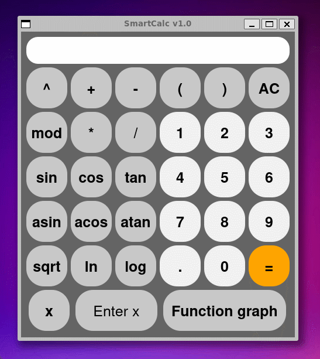
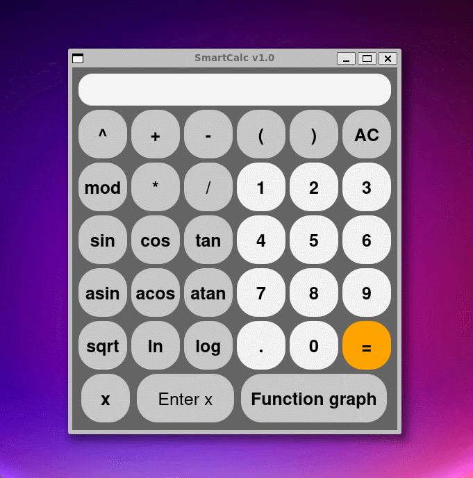

# SmartCalc v1.0

Реализация SmartCalc v1.0.

## Information

В данном проекте реализована расширенная версия обычного калькулятора. Помимо базовых арифметических операций, как плюс-минус и умножить-поделить, реализована возможность вычисления арифметических выражений с учетом приоритетов, а также некоторыми математическими функциями (синус, косинус, логарифм и т.д.). Помимо вычисления выражений калькулятор поддерживает использование переменной _x_ и построение графика соответствующей функции.

## Реализация алгоритма

Пока в исходной строке есть необработанные лексемы, считываем очередную:

Если лексема:
- Число - добавляем в строку вывода.
- Функция или открывающая скобка - помещаем в стек.
- Разделитель аргументов функции (например, запятая):         
    - Перекладываем операторы из стека в выходную очередь пока лексемой на вершине стека не станет открывающая скобка. Если в стеке не окажется открывающей скобки - в выражении допущена ошибка.
- Оператор (O1):
    - Пока присутствует на вершине стека лексема-оператор (O2) чей приоритет выше приоритета O1, либо при равенстве приоритетов O1 является левоассоциативным:
        - Перекладываем O2 из стека в выходную очередь.
    - Помещаем O1 в стек.
- Закрывающая скобка:
    - Пока лексема на вершине стека не станет открывающей скобкой, перекладываем лексемы-операторы из стека в выходную очередь.
    - Удаляем из стека открывающую скобку.
    - Если лексема на вершине стека — функция, перекладываем её в выходную очередь.
    - Если стек закончился до того, как была встречена открывающая скобка - в выражении содержится ошибка.

Если во входной строке больше не осталось лексем:
- Пока есть операторы в стеке:
    - Если на вершине стека скобка - в выражении допущена ошибка.
    - Перекладываем оператор из стека в выходную очередь.

Конец.

## Build

Сборка программы настроена с помощью Makefile

* `make install` - Сборка программы SmartCalc_v1.0
* `make unistall` - Удаление программы
* `make dvi` - Компиляция .tex файла с описанием проекта
* `make dist` - Архивирование проекта
* `make test` - Покрытие unit-тестами функций вычисления c помощью библиотеки Check
* `make gcov_report` - Формирование отчёта gcov в виде html страницы
* `make leaks` - Проверка тестов на утечки памяти (Linux - valgrind, MacOS - leaks)
* `make clang` - Проверка кода на Google style
* `make clean` - Удаление ненужных файлов

## Реализация SmartCalc v1.0

- Программа разработана на языке С стандарта C11 с использованием компилятора gcc, также использовались дополнительные библиотеки и модули QT;
- Программа разработана в соответствии с принципами структурного программирования;
- Реализация графического пользовательского интерфейса на базе GUI-библиотеки Qt
- На вход программы могут подаваться как целые числа, так и вещественные числа, записанные через точку;
- Вычисление производится после полного ввода вычисляемого выражения и нажатия на символ `=`;
- Вычисление произвольных скобочных арифметических выражений в инфиксной нотации;
- Вычисление произвольных скобочных арифметических выражений в инфиксной нотации с подстановкой значения переменной _x_ в виде числа;
- Построение графика функции, заданной с помощью выражения в инфиксной нотации с переменной _x_ (с координатными осями, отметкой используемого масштаба и сеткой с адаптивным шагом);
- У пользователя есть возможность ввода до 255 символов;
- Скобочные арифметические выражения в инфиксной нотации поддерживают следующие арифметические операции и математические функции:
    - **Арифметические операторы**:

        | Название оператора | Инфиксная нотация   (Классическая) | Префиксная нотация   (Польская нотация) |  Постфиксная нотация   (Обратная польская нотация) |
        | ------ | ------ | ------ | ------ |
        | Скобки | (a + b) | (+ a b) | a b + |
        | Сложение | a + b | + a b | a b + |
        | Вычитание | a - b | - a b | a b - |
        | Умножение | a * b | * a b | a b * |
        | Деление | a / b | / a b | a b \ |
        | Возведение в степень | a ^ b | ^ a b | a b ^ |
        | Остаток от деления | a mod b | mod a b | a b mod |
        | Унарный плюс | +a | +a | a+ |
        | Унарный минус | -a | -a | a- |

    - **Функции**:
  
        | Описание функции | Функция |   
        | ---------------- | ------- |  
        | Вычисляет косинус | cos(x) |   
        | Вычисляет синус | sin(x) |  
        | Вычисляет тангенс | tan(x) |  
        | Вычисляет арккосинус | acos(x) | 
        | Вычисляет арксинус | asin(x) | 
        | Вычисляет арктангенс | atan(x) |
        | Вычисляет квадратный корень | sqrt(x) |
        | Вычисляет натуральный логарифм | ln(x) | 
        | Вычисляет десятичный логарифм | log(x) |

## Примеры работы SmartCalc v1.0

* Вычисление арифметических выражений в инфиксной нотации

* Вычисление арифметических выражений в инфиксной нотации с подстановкой _x_

* Построение графика функции

